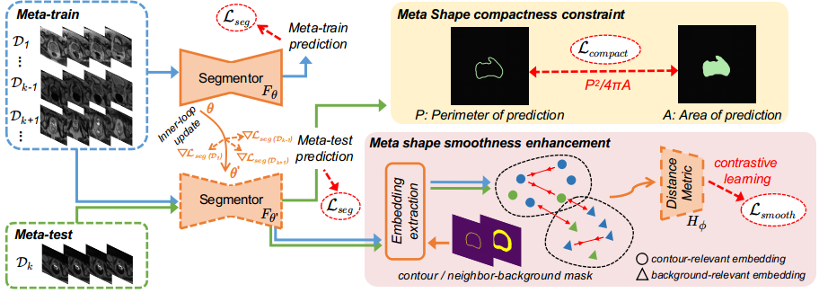

# SAML & A Multi-site Dataset for Prostate MRI Segmentation
by [Quande Liu](https://github.com/liuquande), [Qi Dou](http://www.cse.cuhk.edu.hk/~qdou/), [Pheng-Ann Heng](http://www.cse.cuhk.edu.hk/~pheng/). 

### Introduction

* The Tensorflow implementation for our MICCAI 2020 paper '[Shape-aware Meta-learning for Generalizing Prostate MRI Segmentation to Unseen Domains](https://github.com/liuquande/SAML)'. 

<p align="center">
  
</p>

* A well-organized multi-site dataset (from six data sources) for prostate MRI segmentation, that can support research in various problem settings with need of multi-site data, such as [Domain Generalization](https://github.com/amber0309/Domain-generalization), [Multi-site Learning](https://arxiv.org/abs/2002.03366) and [Life-long Learning](https://arxiv.org/abs/1805.10170), etc. For more details and downloading link of the dataset, please [Find Here](https://liuquande.github.io/SAML/).
    

<p align="center">
  
</p>
  

### Setup & Usage for the Code

1. Check dependencies:
   ```shell
   python==2.7.17
   numpy==1.16.6
   scipy==1.2.1
   tensorflow-gpu==1.12.0
   tensorboard==1.12.2
   SimpleITK==1.2.0
   ```
2. To train the model, you need to specify the training configurations (can simply use the default setting) in main.py, then run:
   ```shell
   python main.py --phase=train
   ```

2. To evaluate the model, run:
   ```shell
   python main.py --phase=test --restore_model='/path/to/test_model.cpkt'
   ```
   You will see the output results in the folder `./output/`.


### Questions

For further question about the code or dataset, please contact 'qdliu@cse.cuhk.edu.hk'
